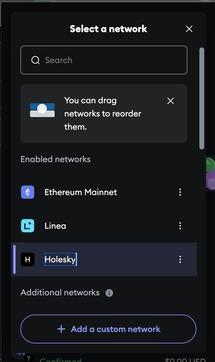
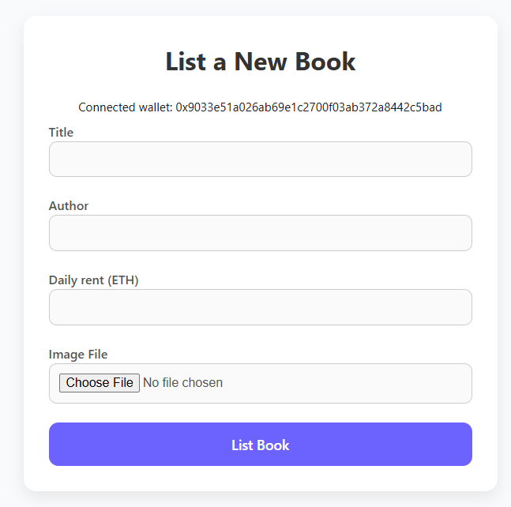
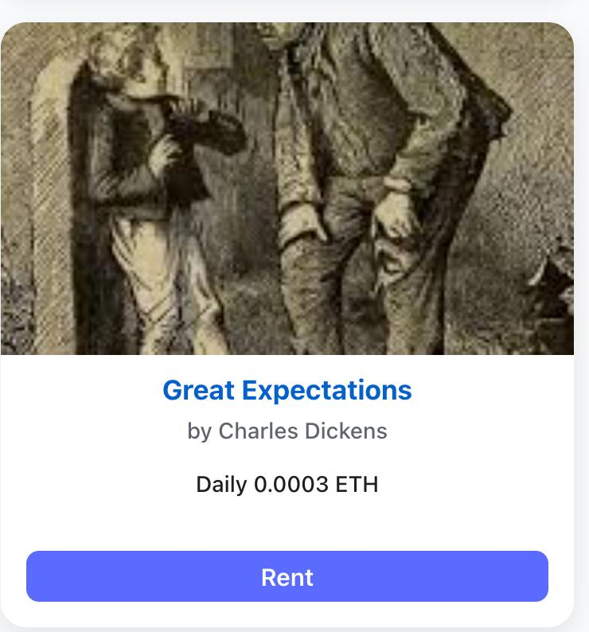
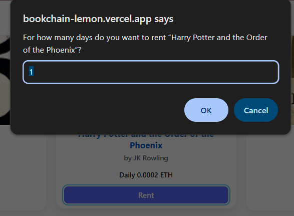
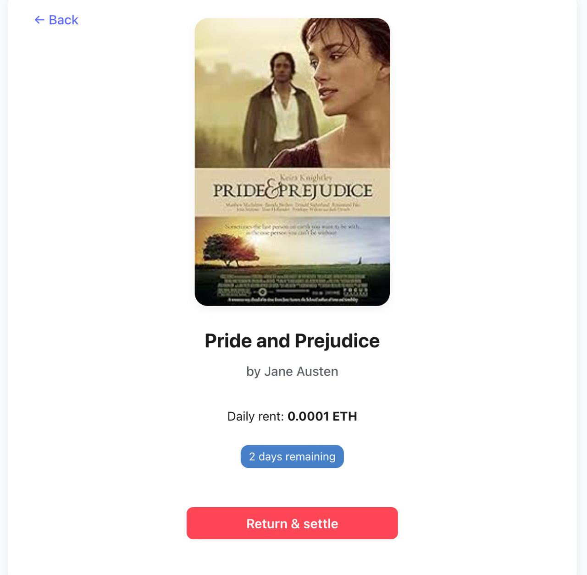
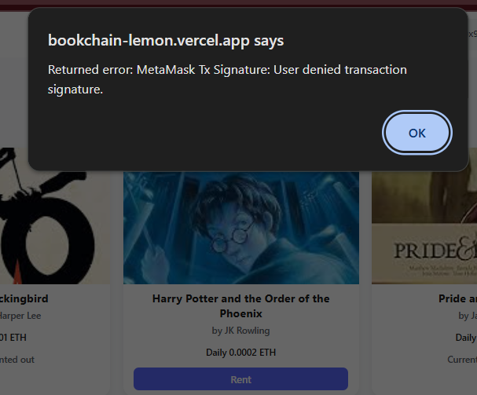
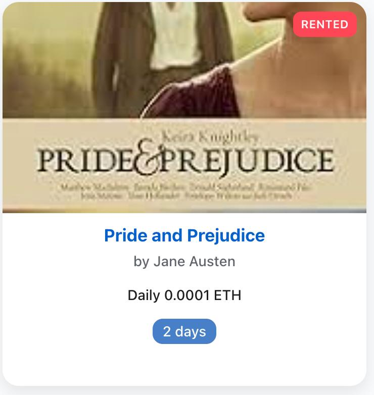
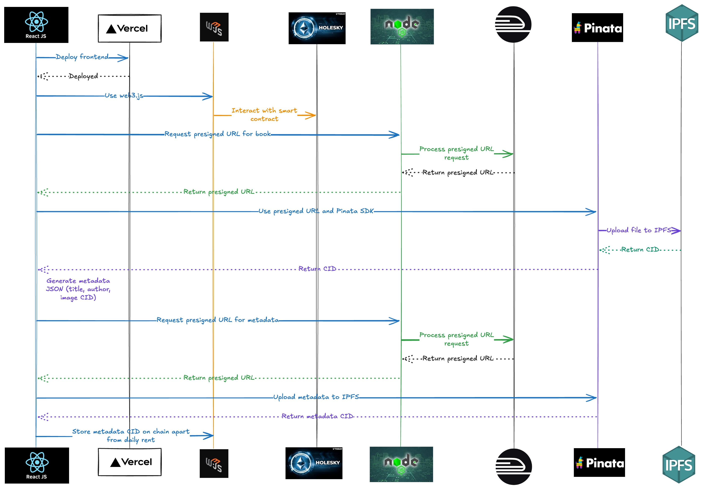
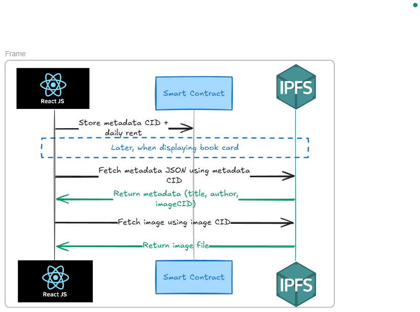
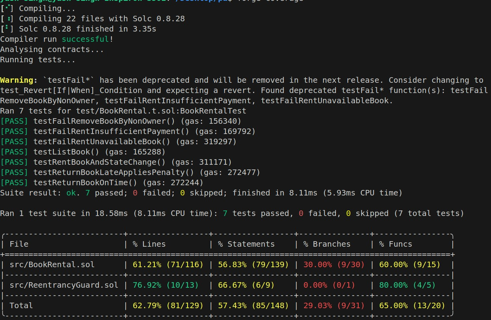

# Decentralized Book Rental

## Project Objective

Develop a trustless book rental platform that enables:

- Owners to list books or items for rent, specifying a deposit amount and daily rental fee  
- Renters to borrow listed items by paying the required deposit and rental charges  

The platform leverages Ethereum smart contracts to:

- Securely hold deposits until items are returned  
- Automatically refund deposits after deducting applicable rental fees  
- Enforce penalties for late returns

Team Members:
<br>
- [Param Saxena(230001060)](https://github.com/SAXENA-PARAM)
- [Saumya Vaidya(230008035)](https://github.com/samthedoctor)
- [Jagrit(230051005)](https://github.com/idJagrit)
- [Jai Pannu(230004019)](https://github.com/JaiPannu-IITI)
- [Krishay Rathaure(230004026)](https://github.com/Quanmat)
- [Rudra Jadon(230004043)](https://github.com/rudrajadon)

## Setup Instructions

### 1. Prerequisites
Ensure you have the following installed/configured:
- **Node.js** (v16 or above)
- **npm** 
- **MetaMask** browser extension (for Ethereum wallet)
- **Remix IDE** ([remix.ethereum.org](https://remix.ethereum.org/)) for smart contract deployment
- **Pinata account** ([pinata.cloud](https://pinata.cloud/)) for IPFS file storage
- **Railway account** ([railway.app](https://railway.app/)) for backend server deployment
- **Vercel account** ([vercel.com](https://vercel.com/)) for frontend deployment (or run locally)

---
### 2. Deployment Status
The website is live and accessible at [bookchain-lemon.vercel.app](https://bookchain-lemon.vercel.app/), having been successfully deployed to the Vercel hosting platform.

---

### 3. Smart Contract Deployment (Sepolia Testnet)
1. **Open Remix IDE**:  
   Go to [remix.ethereum.org](https://remix.ethereum.org/).

2. **Add Holesky Testnet to MetaMask**:  
   - Visit [Chainlist](https://chainlist.org/chain/17000).
   - Click **Connect Wallet** to add it to MetaMask.
   - This step is essential because Remix operates on a public Ethereum testnet. To ensure compatibility, the MetaMask wallet must be connected to the same network—specifically the Holesky testnet via Chainlist. Test ETH can be obtained from the Sepolia faucet to fund transactions during development and testing.

3. **Get Sepolia Testnet ETH**:  
   Use [Google Cloud Sepolia Faucet](https://cloud.google.com/application/web3/faucet/ethereum/sepolia) to get test tokens in your metamask account. 

4. **View Transactions**:  
   Check activity on:  
   - [Holesky Explorer](https://eth-holesky.blockscout.com/address/0xaFcA4e33E00CFF39BF2278202e8ABA507dF92ea5?tab=txs)  

---

<table>
  <tr>
    <td style="width: 50%; vertical-align: top; padding-right: 20px;">
      <h3>4. Connect MetaMask</h3>
      <ol>
        <li><strong>Ensure Holesky Testnet is Active</strong>:<br>Select "Holesky" in MetaMask.</li>
        <li><strong>Get Test ETH</strong>:<br>Use the faucet listed in Step 3.</li>
        <li><strong>Connect to Frontend</strong>:<br>Click <strong>Connect Wallet</strong> on the frontend and approve in MetaMask.</li>
      </ol>
      <p>You can see in the given image as well.</p>
    </td>
    <td style="width: 50%; text-align: center;">
      
    </td>
  </tr>
</table>

---

### 5. Backend (Pinata Server) Setup

1. **Deploy to Railway**  
   - This is backend server repository: [Pinata](https://github.com/SAXENA-PARAM/Pinata-server) and has been successfully deployed to [Railway](https://railway.app/).  
   - This backend server handles file uploads to IPFS via the Pinata service by generating pre-signed URLs.

2.**Note API Endpoint**  
   - This will be used by the frontend to request pre-signed URLs `/presigned_url`.

---

### 6. Frontend Setup
- The frontend is deployed on Vercel

- It uses `web3.js` to interact with the smart contract deployed on the Holesky Ethereum testnet.

#### 🎉 YOU ARE READY TO USE THE PLATFORM NOW!! 🚀🎯

 ---
## Home Page 

## Marketplace

<br>
Displays books rented by the user in the "MY Books" Section:-
<br>


## Contract Explanation

### Overview
The smart contract enables a trustless book/item rental system where:
- **Owners** list items for rent with a daily price and deposit.
- **Renters** pay a deposit upfront (covering rental fees + maximum penalties) to borrow items.
- **Late returns** are automatically penalized up to a predefined limit (`max_penalty_days`), after which the item is auto-returned.

---

### Key Variables
1. **`max_penalty_days`**  
   - Maximum days a renter can be late (e.g., 5 days).  
   - After this period, the item is auto-returned, and the deposit is fully consumed.  

2. **`max_penalty_fees`**  
   - Penalty charged per late day (e.g., 0.01 ETH).  

3. **`Item` Struct**  
   - Stores item details and rental status:  
     ```
     struct Item {
         address owner;
         string title;
         uint256 dailyPrice;
         uint256 deposit;
         bool isAvailable;
         uint256 rentalStartTime;
         address renter;
     }
     ```

4. **Mappings**  
   - `items`: Maps item IDs to their `Item` struct.  
   - `rentals`: Tracks active rentals by renter address.  

---

### Core Functions

<table>
  <tr>
    <td style="width: 50%; vertical-align: top; padding-right: 20px;">
      <h4>1. <code>listItem</code></h4>
      <ul>
        <li><strong>Purpose</strong>:<br>Allows owners to list items for rent.</li>
        <li><strong>Parameters</strong>:
          <ul>
            <li><code>title </code>: Name/description of the item.</li>
            <li><code>dailyPrice</code>: Daily Rent (in ETH).</li>
            <li><code>image </code>: Image file of the item.</li>
          </ul>
        </li>
        <li><strong>Logic</strong>:
          <ul>
            <li>Stores the item in the <code>items</code> mapping.</li>
            <li>Confirms the transaction with MetaMask.</li>
            <li>Emits an <code>ItemListed</code> event.</li>
          </ul>
        </li>
      </ul>
    </td>
    <td style="width: 50%; text-align: center;">
      
    </td>
  </tr>
</table>

<table>
  <tr>
    <td style="width: 50%; vertical-align: top; padding-right: 20px;">
      <h4>2. <code>rentItem</code></h4>
      <ul>
        <li><strong>Purpose</strong>:<br>Renters borrow items by paying the deposit.</li>
        <li><strong>Parameters</strong>:
          <ul>
            <li><code>item</code>: Name of the item to rent.</li>
            <li><code>rentalDays</code>: Number of days the renter intends to use the item.</li>
          </ul>
        </li>
        <li><strong>Logic</strong>:
          <ul>
            <li>Sends a pop-up on UI to ask the user how many days they want to rent the item. (See images →)</li>
            <li>Validates payment:
              <pre><code>require(msg.value == item.deposit, "Incorrect deposit");</code></pre>
            </li>
            <li>Locks the item (<code>isAvailable = false</code>).</li>
            <li>Records rental start time and renter address.</li>
            <li>Emits an <code>ItemRented</code> event.</li>
          </ul>
        </li>
      </ul>
    </td>
    <td style="width: 50%; text-align: center;">
      
      
    </td>
  </tr>
</table>

<table style="width: 100%; table-layout: fixed;">
  <tr>
    <td style="width: 50%; vertical-align: top; padding-right: 20px;">
      <h4>3. <code>returnItem</code></h4>
      <ul>
        <li><strong>Purpose</strong>:<br>Renters return items to claim a refund.</li>
        <li><strong>Parameters</strong>:
          <ul>
            <li><code>item</code>: ID of the item being returned.</li>
          </ul>
        </li>
        <li><strong>Logic</strong>:
          <ul>
            <li>Calculates rental duration:
              <pre><code>uint256 daysRented = (block.timestamp - rentalStartTime) / 86400;</code></pre>
            </li>
            <li>Computes refund:
              <pre><code>uint256 refund = item.deposit - (daysRented * item.dailyPrice);</code></pre>
            </li>
            <li>Previews days remaining to the user who has rented the item.</li>
            <li>If the user returns the item on the first day itself, then 1 day rent is deducted from the total deposit and rest is refunded to the user.</li>
            <li>Owner cannot rent their own item; they are shown <code>your_book</code> on the UI.</li>
            <li>Deducts penalties for late returns up to <code>max_penalty_days</code>.</li>
            <li>Transfers refund to renter and remaining funds to owner.</li>
            <li>Emits an <code>ItemReturned</code> event.</li>
          </ul>
        </li>
      </ul>
    </td>
    <td style="width: 50%; vertical-align: top; text-align: center;">
      
      
    </td>
  </tr>
</table>

<table>
  <tr>
    <td style="width: 50%; vertical-align: top; padding-right: 20px;">
      <h4>4.Error Handling</h4>
      <ul>
            <li> If in the course of using the app, there is an event of failed transaction due to any unexpected error, then user is notified with this kind of pop-up.</li>
        </li>
      </ul>
    </td>
    <td style="width: 50%; text-align: center;">
      
    </td>
  </tr>
</table>

---

### Penalty System
The deposit is calculated as:  

| Scenario          | Refund Calculation                          |
|-------------------|---------------------------------------------|
| **Early return**  | Unused penalty fees are refunded.           |
| **Late return**   | Penalties deducted daily up to `max_penalty_days`. |

If `max_penalty_days` are exceeded, then book is autoreturned. There is a backend server running which uses the smart contract `gentRental` status function and checks if the item has been issued for more than the `max_penalty_days` + `rented_days`
**Example**:  
- `daily_price = 0.1 ETH`, `max_penalty_days = 5`, `max_penalty_fees = 0.01 ETH`  
- Rent for **3 days**:  
  - **Deposit** = `(3 × 0.1) + (5 × 0.01) = 0.35 ETH`  
  - **Returned on day 3**: Refund = `0.35 - (3 × 0.1) = 0.05 ETH`  
  - **Returned on day 8**: Refund = `0.35 - (3 × 0.1)-(5 × 0.01) = 0.0 ETH` (full deposit exhausted and item autoreturned).  

---

### Events
- **`BookListed`**  
- **`BookRented`**  
- **`BookReturned`**  

---
<table>
  <tr>
    <td style="width: 50%; vertical-align: top; padding-right: 20px;">
      <h4>4. <code>Security Features</code></h4>
      <ul>
        <li><strong>Reentrancy Guard</strong>:<br>
          Uses OpenZeppelin’s <code>ReentrancyGuard</code>. We used the following import to implement the reentrancy protection:
          <pre><code>import "@openzeppelin/contracts/security/ReentrancyGuard.sol";</code></pre>
        </li>
        <li><strong>Input Validation</strong>:<br>
          Checks for correct deposit amounts and item availability.
        </li>
        <li><strong>Book owners cannot rent their own listed items</strong>:<br>
          This restriction is enforced at the smart contract level, preventing owners from initiating rental transactions for their own books or items.
        </li>
        <li><strong>Already rented items are blocked from further rentals</strong>:<br>
          If the item is already rented out by someone else, then other users can't rent it. UI shows <code>"currently rented out"</code>.
        </li>
        </br>  
      </ul>
    </td>
    <td style="width: 50%; text-align: center;">
      
      
    </td>
  </tr>
</table>


---
## Workflow Summary and Off-Chain and On Chain- Data Storage:


- When uploading, the frontend sends a request to the Railway-hosted backend to obtain a pre-signed URL.
- It then uses the Pinata SDK to upload the file to IPFS, receiving back a CID.
- The frontend generates a metadata JSON, uploads it using the same flow, and receives another CID representing the metadata.
- Contract address and AIB's stored in `constant.js`.

<br>
It can be clearly infered from summary and the flowcharts presented that:
- Only `CID` from the items listing is stored on-chain along with `daily_rent`'s. So user's personal data isn't being saved on-chain.
- Rest of the data is stored off-chain in Pinata. 
---
This section explains how to test the core functionalities of your smart contract and platform to ensure all features work as intended.

### 1. Prerequisites
- Smart contract deployed on Holesky testnet (see [Setup Instructions](#setup-instructions))
- Test ETH in your MetaMask wallet (from Sepolia faucet)
- Access to your frontend (locally or on Vercel)
- *(Optional)* Remix IDE for manual contract interaction

---

### 2. Manual Testing via Frontend

#### **A. Listing an Item**
1. Connect MetaMask with an account that owns books/items.
2. Go to the **"List Item"** page.
3. Fill in the item details:
   - Title (e.g., "The Alchemist")
   - Daily Price (e.g., 0.1 ETH)
   - Deposit (auto-calculated based on rental days and penalties)
4. Submit the form.
5. **Expected Result**: The item appears in the marketplace as available for rent.

#### **B. Renting an Item**
1. Switch to a renter account in MetaMask.
2. Browse the marketplace and select an available item.
3. Enter the number of days to rent (e.g., 3 days).
4. Confirm and pay the deposit (including rental fee + max penalty).
5. **Expected Result**:  
   - The item is marked as **"Rented"**.  
   - It disappears from the marketplace for other users.

#### **C. Returning an Item**
1. As the renter, go to **"My Rentals"**.
2. Click **"Return"** on an active rental.
3. Confirm the transaction in MetaMask.
4. **Expected Result**:  
   - Refund is sent to the renter (unused penalty refunded if returned early).  
   - Item reappears in the marketplace.  
   - If late, penalty is deducted up to `max_penalty_days`.

#### **D. Auto-Return on Max Penalty**
1. Rent an item and **do not return it** within the allowed period.
2. Wait for `max_penalty_days` to expire (e.g., 5 days).
3. **Expected Result**:  
   - Item is auto-returned.  
   - Full deposit is consumed (no refund).  
   - Item becomes available again.

---

### 3. Manual Testing via Foundry
Following result window was obtained on testing the system of Foundry:
<br>


You can visit this: [This Repository](https://github.com/SAXENA-PARAM/BookChain-Testing) to clone and test the testing system.
---
Note: Image Examples were taken from different user accounts, that's why there can be a contradiction in the images of different functions about some item, but in their own topic they are putted, keeping each significant to thier topic/feature.